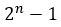

Java Equation Tower of Hanoi
============================

Example Application: Tower of Hanoi


# Equation | Formula

> 

```java
Math.pow(2, n)-1;
```

## Some links for more in depth learning

* [JAVA PRINT](https://github.com/fefong/java_print);
* [JAVA SWITCH CASE](https://github.com/fefong/java_switch);
* [JAVA IF/ELSE](https://github.com/fefong/java_ifElse);
* [JAVA ARITHMETIC](https://github.com/fefong/java_calculator);

* [JAVA](https://github.com/search?q=fefong%2Fjava)

